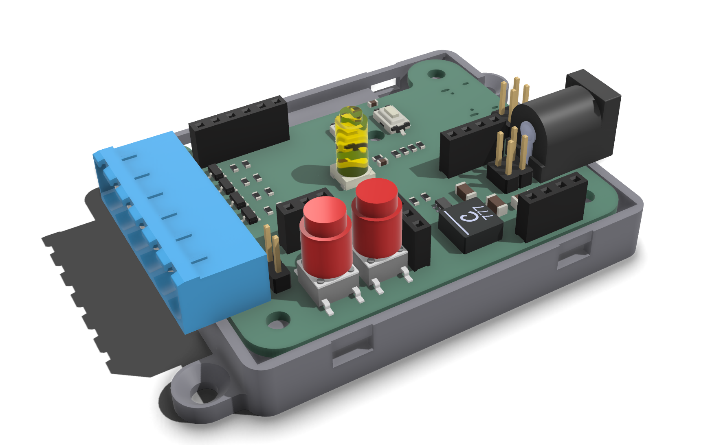
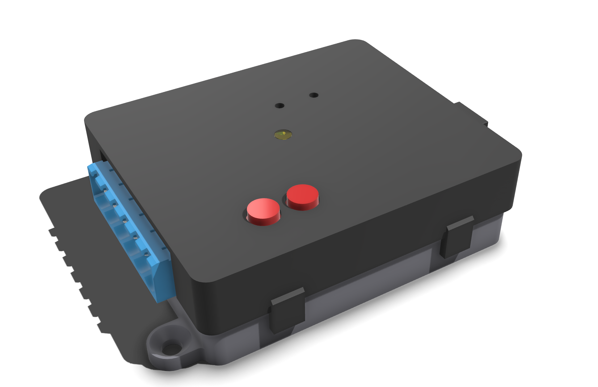

# LED Driver - Starfish
ESP32 based LED driver designed for use with ESPHome.

The pcb is designed with KiCad and has a ESP32-S3 with power and usb circuit. A total of four N-Channel FETs allow to switch 12V appliances (LED) upto 4.4A each. The four channels allow multiple LED strips or ones with RGBW etc.

## Features

- ESP32-S3 for use with ESPHome

- 4 Open-Drain Channels for RGBW
- 2 Buttons for user input
- WS2812 LED
- Multiple headers for further peripherals (I2C,  3V3, 5V, GPIOs)
- 6V to 15V Input
