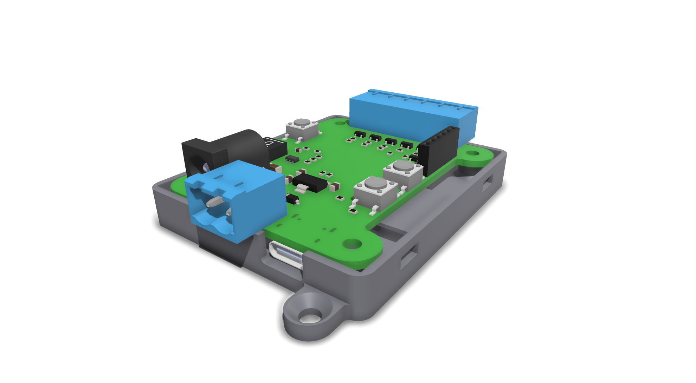

# led-driver-starfish
ESP32 based LED driver designed for use with ESPHome.
 
The pcb is designed with KiCad and has a ESP32-S3 Wroom 1 with power and usb circuit. A total of five N-Channel FETs allow to switch 12V appliances (LED) upto 4.4A each. The five channels allow multiple LED strips or ones with RGB etc. Schematic and gerber files are attached in the release. KiCad project is inside [starfish](starfish).

